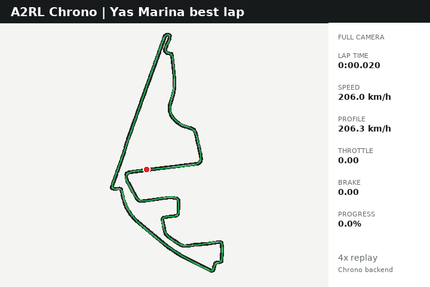
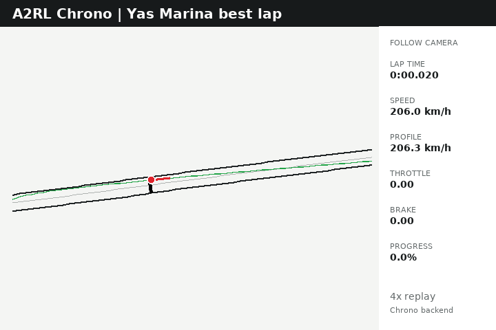

# Chrono A2RL Training

Research scaffold for an A2RL-style autonomous racing training stack:

```text
Project Chrono direct backend
    -> A2RL-style vehicle model
    -> flat Yas Marina track from TUMFTM racetrack-database
    -> DBW-style command interface
    -> MPC controller baseline
    -> Gymnasium environment
    -> Stable-Baselines3 high-level RL policy
    -> ROS 2 runtime integration later
```

The repository is useful before Project Chrono is installed. If Chrono data or
bindings are unavailable, `ChronoDirectBackend` uses a mock kinematic bicycle
simulator. Yas Marina is processed from `TUMFTM/racetrack-database`; the
synthetic oval is now only a fallback if those processed files are removed.

The vehicle profile is based on public A2RL EAV24/EAV25 information: Dallara
autonomous Super Formula platform, K20C1-based turbo engine, 3MO 6-speed
gearbox, Brembo electro-hydraulic carbon brakes, Yokohama Advan tires, and the
published camera/radar/lidar/compute stack. Exact dynamics values remain
documented simulation estimates. The configured platform cap is `300 km/h`,
matching A2RL's published up-to-300 km/h specification. The separately
reported 295 km/h autonomous run remains a useful achieved-speed reference;
neither figure is treated as a private dynamics parameter.

## Best Lap Replay

The current best validated Chrono lap completes the full start/finish crossing
in **1:46.860**, reaches **299.4 km/h**, and records no off-track samples. Both
replays run at 4x speed and come from the same deterministic evaluation log.

| Full track | Follow camera |
|:---:|:---:|
|  |  |

## Installation

```bash
python3 -m venv .venv
source .venv/bin/activate
python3 -m pip install -e .[dev]
```

OSQP is installed with the base package so the full Tube MPC fine-tuning
profile is always available. Optional RL dependencies are installed separately:

```bash
python3 -m pip install -e .[rl]    # Stable-Baselines3 and TensorBoard
```

Editable installation also creates terminal commands:

```text
aa help
aa train
aa eval
aa watch
```

## Run Tests

```bash
python3 -m pytest
```

The suite passes without Chrono, Stable-Baselines3, or external track data.

## Run The MPC Lap With Mock Backend

```bash
python3 scripts/run_mpc_lap.py --config configs/experiments/mpc_yas_marina_flat.yaml --backend mock
```

The default Yas Marina track comes from TUMFTM `tracks/YasMarina.csv` with
`racelines/YasMarina.csv` as the optional raceline. Logs and metrics are written
under `logs/`.

The MPC-only experiment intentionally keeps a conservative target speed profile.
The default controller is the fast tube-aware pure-pursuit raceline tracker.
The full Tube MPC remains available in
`configs/controller/mpc_lateral_full_tube.yaml` for later fine-tuning.

## Run With PyChrono

Install PyChrono in a Python 3.12 conda environment, then run:

```bash
python3 scripts/check_chrono_backend.py
python3 scripts/run_mpc_lap.py --config configs/experiments/mpc_yas_marina_flat.yaml --backend chrono
```

The first Chrono mode is `PyChronoKinematicBackend`: it creates a Chrono system,
flat ground, and chassis body while preserving the scaffold kinematic vehicle
model. This proves the direct Chrono training path and keeps the controller/RL
interfaces stable. A full `pychrono.vehicle` model is the next fidelity upgrade.

## Process Yas Marina Track Data

Do not vendor the full TUMFTM racetrack-database into this repo. The small
processed Yas Marina artifacts are stored under `tracks/yas_marina/processed/`.

```bash
git clone https://github.com/TUMFTM/racetrack-database /path/to/racetrack-database
python3 scripts/process_track.py --tumftm-root /path/to/racetrack-database
python3 scripts/plot_track.py
```

The flexible CSV loader infers common centerline, raceline, and width columns.
If your source file uses unusual column names, normalize it to:

```text
x_m,y_m,w_tr_right_m,w_tr_left_m
```

## Level-1 Track Limits And Curbs

Track limits use TUMFTM left/right widths. Level-1 curbs are flat semantic
1-meter edge zones along both sides of the full loop. They do not alter physics,
but MPC/RL logs and metrics report curb usage and RL rewards can penalize it.

## Chrono Backend Later

Training code should continue to call:

```python
ChronoDirectBackend.reset()
ChronoDirectBackend.step(command, dt)
ChronoDirectBackend.get_state()
```

Real Project Chrono initialization, vehicle spawning, state extraction, and
command application belong only in `src/chrono_a2rl/chrono_interface/`.

## Main RL Commands

The default RL policy fine-tunes longitudinal actuation only:

```text
RL action[0] in [-1, 1]
-1 = maximum brake residual
 0 = follow profile PID unchanged
+1 = maximum throttle residual
```

The speed PID now tracks the green raceline's speed profile directly. PPO emits
only a bounded pedal residual with `8%` authority near the target and no
authority once speed error reaches `18 km/h`. Pedal reversals are rate-limited
before DBW. The TUMFTM green raceline is fixed, so the RL action cannot alter
the line, direction, or steering command. The fast default lateral controller
geometrically tracks a preview point on the green raceline and applies a soft
boundary correction.

Positive dense rewards require forward displacement. Parking for four seconds
terminates the episode as `stalled`, so remaining stationary cannot preserve or
accumulate reward.

Train the shared-frontier longitudinal policy:

```bash
aa train
```

By default this uses vectorized PPO training with eight cars: two start-line
cars validate genuine lap progress, four cars practise shortly before the
shared frontier, and two cars retain randomized whole-track exploration. Tune
the count and vectorization backend in `configs/rl/ppo_planner_policy.yaml`.

Training automatically runs a deterministic evaluation of the final saved model.
To train only:

```bash
aa train --no-eval
```

Override common training settings from the terminal:

```bash
aa train --total-timesteps 250000 --n-envs 4 --vec-env-type dummy --backend mock --seed 42
```

The policy starts with conservative randomized speeds at `0.40-0.85` of the
local raceline profile. State-dependent exploration is resampled every 0.5
seconds, and the reward favors validated on-track progress, clean corner
completion, and achieved speed while retaining quadratic high-speed crash
penalties. Curvature-derived braking windows penalize corner-entry overspeed,
provide a geometry-derived trail-brake target, reward moderate brake-assisted
deceleration, and penalize missed or excessive braking. Passive aerodynamic
deceleration earns no braking bonus. Clear-straight rewards are unchanged.
The stronger default reference looks `350 m` ahead, retains brake farther
toward the apex, and is capped at `0.70`; it remains advisory rather than an
actuator override.

Each plain `aa train` command creates a fresh timestamped run under
`models/ppo_profile_speed_residual/`. This action contract must be trained
fresh; older longitudinal policies directly controlled the pedals.

Continue the newest run with its matching shared progress frontier:

```bash
aa train --resume latest
```

The equivalent convenience form is `aa train --resume-latest`. Only these
latest-resume forms restore frontier state. A plain training command always
starts a fresh network, optimizer, run directory, and `350 m` frontier.

When resuming, `--total-timesteps` means additional environment steps beyond
the loaded checkpoint. PPO overrides such as `--learning-rate`, `--ent-coef`,
`--clip-range`, `--n-steps`, and `--batch-size` are applied to the resumed
model.

You can also resume from a specific Stable-Baselines3 checkpoint:

```bash
aa train --resume-from models/ppo_profile_speed_residual/RUN_ID/ppo_profile_speed_residual_100000_steps.zip
```

Useful training flags include:

```text
--total-timesteps
--n-envs
--vec-env-type subproc|dummy
--backend mock|chrono
--seed
--resume latest
--resume-from PATH
--learning-rate
--batch-size
--n-steps
--ent-coef
--longitudinal-action-deadband
--profile-speed-tracking / --no-profile-speed-tracking
--profile-speed-residual-authority
--profile-speed-residual-error-guard-mps
--vehicle-max-accel
--randomize-resets / --no-randomize-resets
--reset-speed-min / --reset-speed-max
--reset-speed-mode range|profile
--reset-speed-scale-min / --reset-speed-scale-max
--reset-s-fraction-min / --reset-s-fraction-max
--reset-lateral-offset-max
--reset-heading-error-max
--target-speed-scale-min / --target-speed-scale-max
--straight-min-speed-scale / --corner-min-speed-scale
--unstable-min-speed-scale
--speed-scale-increase-rate / --speed-scale-decrease-rate
--speed-demand-curvature-source raceline|centerline
--speed-demand-max-decel
--speed-demand-brake-buffer
--speed-demand-transition
--speed-demand-full-reduction
--max-lateral-accel
--lateral-offset-adjustment-scale
```

Trail-braking geometry and reward weights are configured in
`configs/experiments/rl_planner_yas_marina.yaml`.

Evaluate the saved planner policy and write CSV/YAML metrics:

```bash
aa eval --model latest --backend mock
```

Watch the saved planner policy drive around the track in real time:

```bash
aa watch --model latest --backend mock
```

Use a car-following zoom camera for a more involved onboard-style track view:

```bash
aa watch --camera follow --zoom-radius 120 --zoom-ahead 35
```

Use `--realtime-factor 2.0` for 2x speed, `--realtime-factor 0.5` for half
speed, and `--stochastic` if you want to watch exploratory actions instead of
the deterministic policy mean.

When a new best evaluation is recorded, regenerate both curated README GIFs
from its CSV log:

```bash
python3 scripts/render_best_lap_replays.py \
  --log logs/<completed-evaluation>.csv
```

Ordinary evaluation media and logs remain ignored. This command updates only
`docs/assets/replays/best_lap_full.gif` and
`docs/assets/replays/best_lap_follow.gif`.

This planner is the practical path toward autonomous racing behavior without
forcing RL to learn raw steering/throttle/brake stabilization from scratch.

Eight default environments have distinct jobs: two start-line cars establish
validated lap progress, four start `150-250 m` before the current frontier to
practice the failure region, and two explore random track positions. Progress
is validated only after another `40 m` of on-track driving, and one update can
advance the shared frontier by at most `150 m`.

Corner rewards use smoothed track geometry rather than one curvature sample.
The car must pass the apex, traverse the segment, rotate with the corner, and
remain stable for `40 m` after exit before angle, distance, line quality, and
speed can earn up to `700` points. A crash forfeits that reward. Crash cost also
contains a squared-speed term, so arriving at the same failure faster is much
worse. Requested speed itself remains unrewarded; actual safe speed and progress
are what pay.

The older speed-only policy is still available for simpler experiments:

```bash
aa train-speed --config configs/experiments/rl_speed_policy_yas_marina.yaml
```

## Current Limitations

- Full `pychrono.vehicle` dynamics are not implemented yet; the first Chrono
  mode uses an A2RL-style kinematic chassis body.
- Vehicle dynamics parameters are approximate public-reference research values,
  not private A2RL team data.
- Curbs are level-1 semantic flat edge zones; they do not alter mock or Chrono
  tire contact yet.
- Fast training uses tube-aware pure pursuit. A separate linear full Tube MPC
  profile exists for fine-tuning, but it is not yet a nonlinear tire-force MPC.
- ROS 2 runtime integration is documented but intentionally not in the training
  loop.

## Roadmap

1. Replace the kinematic Chrono chassis with a full `pychrono.vehicle` EAV-style model.
2. Validate Yas Marina TUMFTM processing against known lap geometry.
3. Upgrade the linear Tube MPC prediction model to dynamic tire and aero states.
4. Add physical curb and friction zones.
5. Train and evaluate the high-level SB3 profile-residual policy.
6. Add ROS 2 runtime bridge after the direct training loop is stable.
